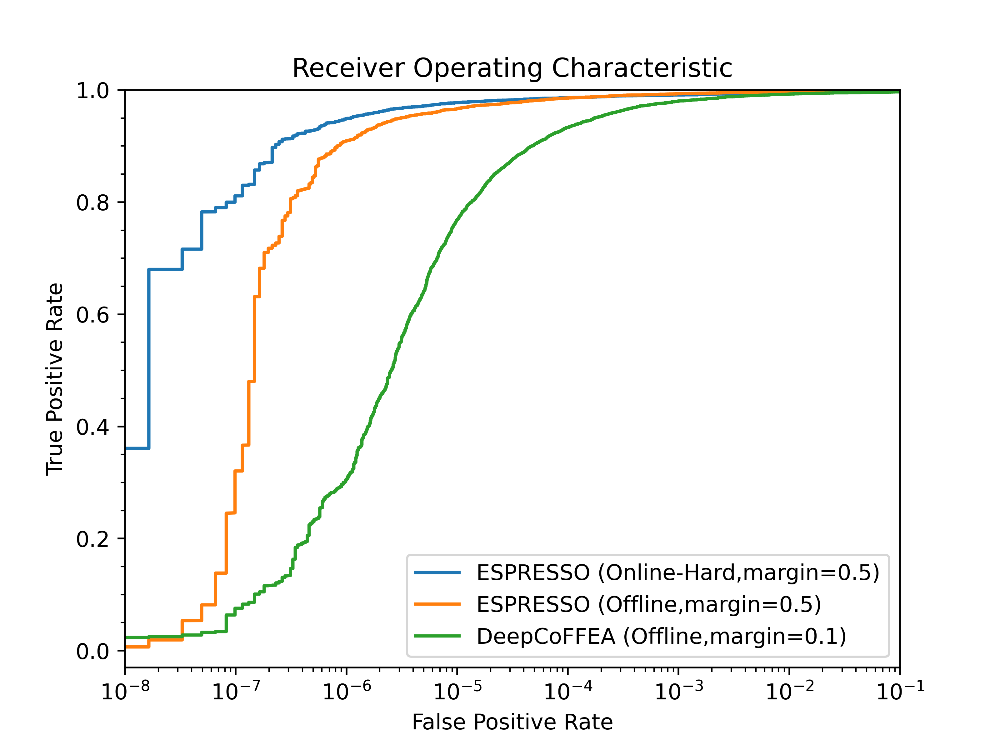

# ESPRESSO: Enhanced Sequential Processing for Reliable End-to-end Signal Synchronization and Observation 

### An improved traffic correlation method for end-to-end flow correlation attacks against Tor



Our new ESPRESSO method gains significant performance improvements over DeepCoFFEA, achieving over 90\% TPR when FPR is at most 10^-6. With Online Hard Triplet mining, ESPRESSO also trains and converges faster (~12 hours) than DeepCoFFEA.

This repository has the following features:
1. Re-implementation of the DeepCoFFEA correlation method for Tor traffic flows using PyTorch.
2. New Online Triplet mining strategies that can be used in place of Offline mining.
3. New MLP-based correlation prediction that can be used in place of threshold-based window voting.
4. New ESPRESSO transformer-based feature extraction network (FEN) that does not use pre-processed windows.

Furthermore, this repository's implemenation of DeepCoFFEA differs from the [original](https://github.com/traffic-analysis/deepcoffea) in the following ways:
1. This repository is written in PyTorch rather than Tensorflow.
2. The training script applies a learning rate decay of x0.7 every 100 steps (configurable). The AdamW optimizer is used in-place of SGD. Note: the impact of optimizer was not meaningfully explored in this repo.
3. The data split samples and split sizes likely differ from the splits used in the [paper](https://www.computer.org/csdl/proceedings-article/sp/2022/131600b429/1A4Q4jvFYs0).
4. A validation data split is used during training and is required for MLP-based and thresholding-based evaluations.
5. The threshold-based evaluation script applies both local and global thresholds simultaneously. The global threshold used is derived using percentiles of the similarities scores of correlated samples in the validation set.
5. The threshold-based evaluation script varies local, global, and voting thresholds to generate the ROC curve. Unproductive threshold combinations are dropped.

### USAGE

- Train using the original DeepCoFFEA method and FEN
```
python src/train.py --loss_margin 0.1 \
                    --exp_config ./configs/exps/june.json \
                    --net_config ./configs/nets/dcf.json
```

- Train using the ESPRESSO method and FEN
```
python src/train.py --loss_margin 0.5 \
                    --exp_config ./configs/exps/june.json \
                    --net_config ./configs/nets/espresso.json \
                    --online --hard
```

- Generate window similarity matrix using a trained FEN
```
python src/calc-sims.py --dists_file ./exps/1/dists.pkl \
                        --ckpt ${path/to/ckptfile} \
                        --exp_config ./configs/exps/june.json
```

- Evaluate correlation efficacy using window voting and local thresholding
```
python src/benchmark-thr.py --dists_file ./exps/1/dists.pkl \
                            --results_file ./exps/1/res.pkl
```

- Evaluate correlation efficacy using MLP predictor
```
python src/benchmark-mlp.py --dists_file ./exps/1/dists.pkl \
                            --results_file ./exps/1/res.pkl
```

We have also provided an `auto.sh` bash script template for automating the process of running experiments.

